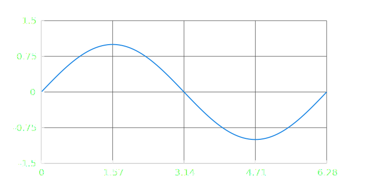

<div align="center">

<br/>
</div>

<div align="center">

<br/><br/>
</div>

A language for creating visualizations using a React-like JSX dialect that evaluates to SVG. Designed for general graphics, plots, graphs, and network diagrams.

Head to **[compendiumlabs.ai/gum](https://compendiumlabs.ai/gum)** for a live demo and documentation. For Python bindings, see [gum.py](https://github.com/CompendiumLabs/gum.py).

# Installation

```bash
bun i gum-jsx
```

# Usage

Write some `gum.jsx` code:

```jsx
<Plot xlim={[0, 2*pi]} ylim={[-1.5, 1.5]} grid margin={[0.2, 0.1]} aspect={2}>
  <SymLine fy={sin} stroke={blue} stroke-width={2} />
</Plot>
```

Then evaluate it to SVG:

```javascript
import { evaluateGum } from 'gum/eval'
const elem = evaluateGum(jsx)
const svg = elem.svg()
```

Which will produce the following:



You can also use JavaScript directly:

```javascript
import { Svg, Box, Text, Circle, Plot, SymLine, pi, sin } from 'gum'
const elem = new Plot({
  children: new SymLine({ fy: sin, stroke: blue, stroke_width: 2 }),
  xlim: [0, 2*pi], ylim: [-1.5, 1.5], grid: true, margin: [0.2, 0.1], aspect: 2,
})
const svg = elem.svg()
```

# CLI

You can use the `gum` command to convert `gum.jsx` into SVG text or PNG data. You can even just display it directly in the terminal! For the latter you need a terminal that supports images, such as `ghostty` or `kitty`. There are a bunch of code examples in `docs/code/` and `docs/gallery/` to try out.

Generate an SVG from a `gum.jsx` file:

```bash
cat input.jsx | bun run cli -f svg > output.svg
```

Generate a PNG from a `gum.jsx` file:

```bash
cat input.jsx | bun run cli -f png > output.png
```

Display a `gum.jsx` file in the terminal:
```bash
cat input.jsx | bun run cli
```

CLI options:

| Option | Description | Default |
|--------|-------------|---------|
| `-s, --size <size>` | Image size in pixels | 500 |
| `-t, --theme <theme>` | Theme: `light` or `dark` | light |
| `-w, --width <width>` | Width of the PNG | null |
| `-h, --height <height>` | Height of the PNG | null |
| `-f, --format <format>` | Format: `svg` or `png` | `svg` |
| `-b, --background <color>` | Background color | null (transparent) |
| `-o, --output <output>` | Output file | null (stdout) |
| `-u, --update` | Live update display | false |
