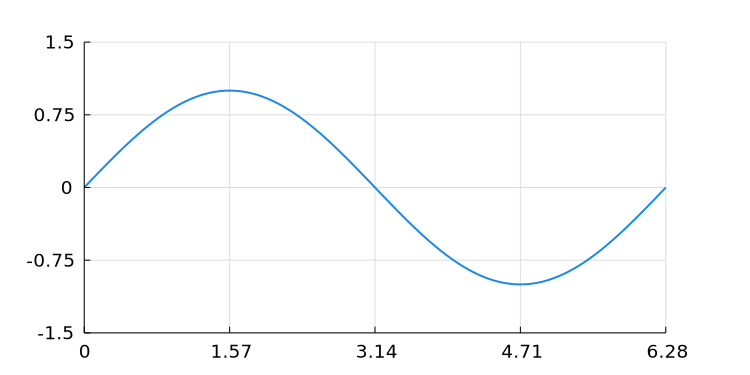

<div align="center">

<br/>
</div>

<div align="center">

<br/><br/>
</div>

<p align="center">
  Gum is a JSX vector graphics language that evaluates to SVG.
  <br/>
  It is designed for plots, diagrams, flow charts, and more.
</p>

<p align="center">
  <a href="https://compendiumlabs.ai/gum/studio">Live Demo</a>
  |
  <a href="https://compendiumlabs.ai/gum/docs">Documentation</a>
  |
  <a href="https://compendiumlabs.ai/gum/docs/gala">Gallery</a>
</p>

## Installation

```bash
bun i gum-jsx
```

This will install the `gum` command and the `gum-jsx` package. Add a `-g` flag to install globally. To download the skill file (which is just a zip), click on the release on the right or use `skills/gum-jsx.skill`.

See [react-gum-jsx](https://github.com/CompendiumLabs/react-gum-jsx) for React bindings. See [gum.py](https://github.com/CompendiumLabs/gum.py) for a Python wrapper.

## Usage

Write some `gum.jsx` code:

```jsx
<Plot xlim={[0, 2*pi]} ylim={[-1.5, 1.5]} grid margin={[0.2, 0.1]} aspect={2}>
  <SymLine fy={sin} stroke={blue} stroke-width={2} />
</Plot>
```

Then evaluate it to SVG:

```javascript
import { evaluateGum } from 'gum/eval'
const elem = evaluateGum(jsx)
const svg = elem.svg()
```

Which will produce the following:



You can also use JavaScript directly:

```javascript
import { Svg, Box, Text, Circle, Plot, SymLine, pi, sin } from 'gum'
const elem = new Plot({
  children: new SymLine({ fy: sin, stroke: blue, stroke_width: 2 }),
  xlim: [0, 2*pi], ylim: [-1.5, 1.5], grid: true, margin: [0.2, 0.1], aspect: 2,
})
const svg = elem.svg()
```

## CLI

You can use the `gum` command to convert `gum.jsx` into SVG text or PNG data. You can even just display it directly in the terminal. For the latter you need a terminal that supports images, such as `ghostty` or `kitty`. There are a bunch of code examples in `docs/code/` and `gala/code/` to try out.

Generate an SVG from a `gum.jsx` file:

```bash
gum input.jsx -o output.svg
```

Generate a PNG from a `gum.jsx` file:

```bash
gum input.jsx -o output.png
```

Display a `gum.jsx` file in the terminal:
```bash
gum input.jsx
```

CLI options:

| Option | Description | Default |
|--------|-------------|---------|
| `file` | Gum JSX file to render | stdin |
| `-s, --size <size>` | Image size in pixels | 1000 |
| `-t, --theme <theme>` | Theme: `light` or `dark` | light |
| `-b, --background <color>` | Background color | white |
| `-f, --format <format>` | Format: `json`, `svg`, `png`, `kitty` | auto |
| `-o, --output <output>` | Output file | stdout |
| `-w, --width <width>` | Max width of the PNG | auto |
| `-h, --height <height>` | Max height of the PNG | auto |
| `-d, --dev` | Live update display | off |
